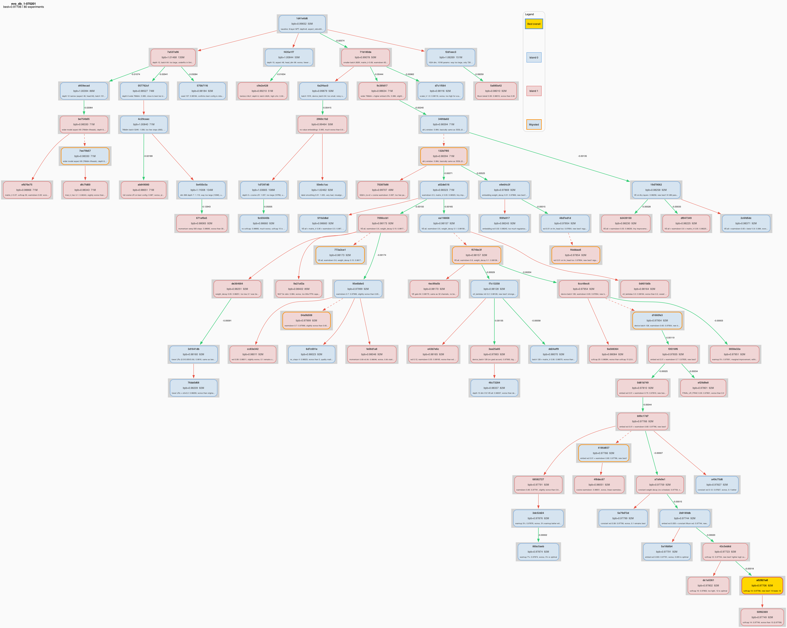

# autoresearch



## What is this?
This is a fork of the [autoresearch](https://github.com/karpathy/autoresearch) project with evolutionary database integration that replaces the simple tsv file based logging in the original project.

Evolutionary algorithms have shown to be a powerful tool for autonomously discovering optimal solutions to problems with large search spaces. Famously, Google DeepMind's [AlphaEvolve](https://arxiv.org/abs/2506.13131) system uses evolutionary algorithms to discover state of the art matrix multiplication algorithms. The implementation of the evolutionary database itself is based heavily on the implementation in [OpenEvolve](https://github.com/algorithmicsuperintelligence/openevolve).

A critical component of such evolutionary systems is the database of past discovered programs (which can be used to guide the search for new solutions). The database uses a simple MAP-Elites approach to maintain a diverse population of solutions across a `N`-dimensional feature grid, with a fitness metric to compare solutions and guide the search. Each time we sample, the database returns solutions from a random island along with a "strategy" hint (exploit/explore/random) to guide the search. The "strategy" hint itself is a simple probabilistic distribution over the three strategies, which can be tuned to control the balance of exploitation and exploration.

The evolutionary database itself has a few hyperparameters that can be tuned which change how the search process unrolls
For example, the number of islands, the number of generations, the number of solutions to maintain in the database, the number of solutions to sample from the database for each new solution, the fitness metric, etc.

So far, evolutionary algorithms have been used in relatively simple domains with easily verifiable outcomes and an environment that is relatively easy to simulate, unlike the autoresearch problem where each training run costs real money in terms of GPU-hours.
It would be interesting to see what set of hyperparameters would work best for the autoresearch problem.

## How it works

The repo is deliberately kept small and only really has three files that matter:

- **`prepare.py`** — fixed constants, one-time data prep (downloads training data, trains a BPE tokenizer), and runtime utilities (dataloader, evaluation). Not modified.
- **`train.py`** — the single file the agent edits. Contains the full GPT model, optimizer (Muon + AdamW), and training loop. Everything is fair game: architecture, hyperparameters, optimizer, batch size, etc. **This file is edited and iterated on by the agent**.
- **`program.md`** — baseline instructions for one agent. Point your agent here and let it go. **This file is edited and iterated on by the human**.

By design, training runs for a **fixed 5-minute time budget** (wall clock, excluding startup/compilation), regardless of the details of your compute. The metric is **val_bpb** (validation bits per byte) — lower is better, and vocab-size-independent so architectural changes are fairly compared.

If you are new to neural networks, this ["Dummy's Guide"](https://x.com/hooeem/status/2030720614752039185) looks pretty good for a lot more context.

## Quick start

**Requirements:** A single NVIDIA GPU (tested on H100), Python 3.10+, [uv](https://docs.astral.sh/uv/).

```bash

# 1. Install uv project manager (if you don't already have it)
curl -LsSf https://astral.sh/uv/install.sh | sh

# 2. Install dependencies
uv sync

# 3. Download data and train tokenizer (one-time, ~2 min)
uv run prepare.py

# 4. Manually run a single training experiment (~5 min)
uv run train.py
```

If the above commands all work ok, your setup is working and you can go into autonomous research mode.

## Running the agent

Simply spin up your Claude/Codex or whatever you want in this repo (and disable all permissions), then you can prompt something like:

```
Hi have a look at program.md and let's kick off a new experiment! let's do the setup first.
```

The `program.md` file is essentially a super lightweight "skill".

## Project structure

```
prepare.py                    — constants, data prep + runtime utilities (do not modify)
train.py                      — model, optimizer, training loop (agent modifies this)
evo_db.py                     — evolutionary database manager (do not modify)
visualize_lineage_tree.py     — visualizes the lineage tree of the evolutionary database (do not modify)
program.md                    — agent instructions
pyproject.toml                — dependencies
```

## Design choices

- **Single file to modify.** The agent only touches `train.py`. This keeps the scope manageable and diffs reviewable.
- **Fixed time budget.** Training always runs for exactly 5 minutes, regardless of your specific platform. This means you can expect approx 12 experiments/hour and approx 100 experiments while you sleep. There are two upsides of this design decision. First, this makes experiments directly comparable regardless of what the agent changes (model size, batch size, architecture, etc). Second, this means that autoresearch will find the most optimal model for your platform in that time budget. The downside is that your runs (and results) become not comparable to other people running on other compute platforms.
- **Self-contained.** No external dependencies beyond PyTorch and a few small packages. No distributed training, no complex configs. One GPU, one file, one metric.

## Platform support

This code currently requires that you have a single NVIDIA GPU. In principle it is quite possible to support CPU, MPS and other platforms but this would also bloat the code. I'm not 100% sure that I want to take this on personally right now. People can reference (or have their agents reference) the full/parent nanochat repository that has wider platform support and shows the various solutions (e.g. a Flash Attention 3 kernels fallback implementation, generic device support, autodetection, etc.), feel free to create forks or discussions for other platforms and I'm happy to link to them here in the README in some new notable forks section or etc.

Seeing as there seems to be a lot of interest in tinkering with autoresearch on much smaller compute platforms than an H100, a few extra words. If you're going to try running autoresearch on smaller computers (Macbooks etc.), I'd recommend one of the forks below. On top of this, here are some recommendations for how to tune the defaults for much smaller models for aspiring forks:

1. To get half-decent results I'd use a dataset with a lot less entropy, e.g. this [TinyStories dataset](https://huggingface.co/datasets/karpathy/tinystories-gpt4-clean). These are GPT-4 generated short stories. Because the data is a lot narrower in scope, you will see reasonable results with a lot smaller models (if you try to sample from them after training).
2. You might experiment with decreasing `vocab_size`, e.g. from 8192 down to 4096, 2048, 1024, or even - simply byte-level tokenizer with 256 possibly bytes after utf-8 encoding.
3. In `prepare.py`, you'll want to lower `MAX_SEQ_LEN` a lot, depending on the computer even down to 256 etc. As you lower `MAX_SEQ_LEN`, you may want to experiment with increasing `DEVICE_BATCH_SIZE` in `train.py` slightly to compensate. The number of tokens per fwd/bwd pass is the product of these two.
4. Also in `prepare.py`, you'll want to decrease `EVAL_TOKENS` so that your validation loss is evaluated on a lot less data.
5. In `train.py`, the primary single knob that controls model complexity is the `DEPTH` (default 8, here). A lot of variables are just functions of this, so e.g. lower it down to e.g. 4.
6. You'll want to most likely use `WINDOW_PATTERN` of just "L", because "SSSL" uses alternating banded attention pattern that may be very inefficient for you. Try it.
7. You'll want to lower `TOTAL_BATCH_SIZE` a lot, but keep it powers of 2, e.g. down to `2**14` (~16K) or so even, hard to tell.

I think these would be the reasonable hyperparameters to play with. Ask your favorite coding agent for help and copy paste them this guide, as well as the full source code.

## Notable forks

- [miolini/autoresearch-macos](https://github.com/miolini/autoresearch-macos) (MacOS)
- [trevin-creator/autoresearch-mlx](https://github.com/trevin-creator/autoresearch-mlx) (MacOS)
- [jsegov/autoresearch-win-rtx](https://github.com/jsegov/autoresearch-win-rtx) (Windows)

## License

MIT
